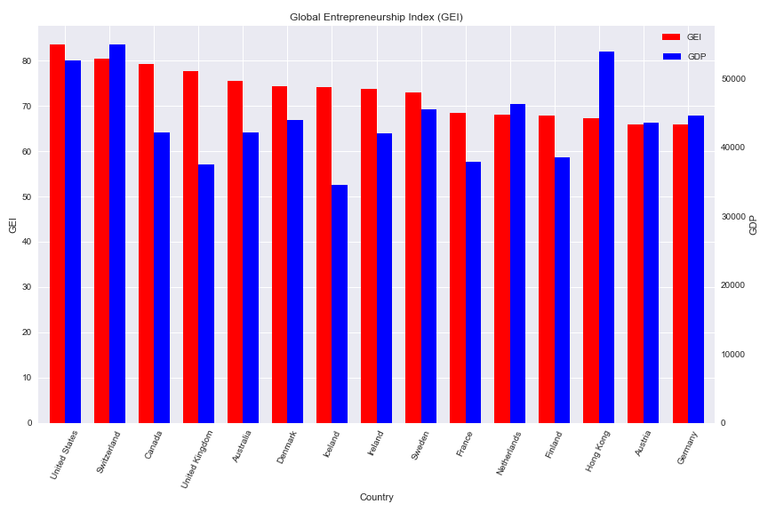
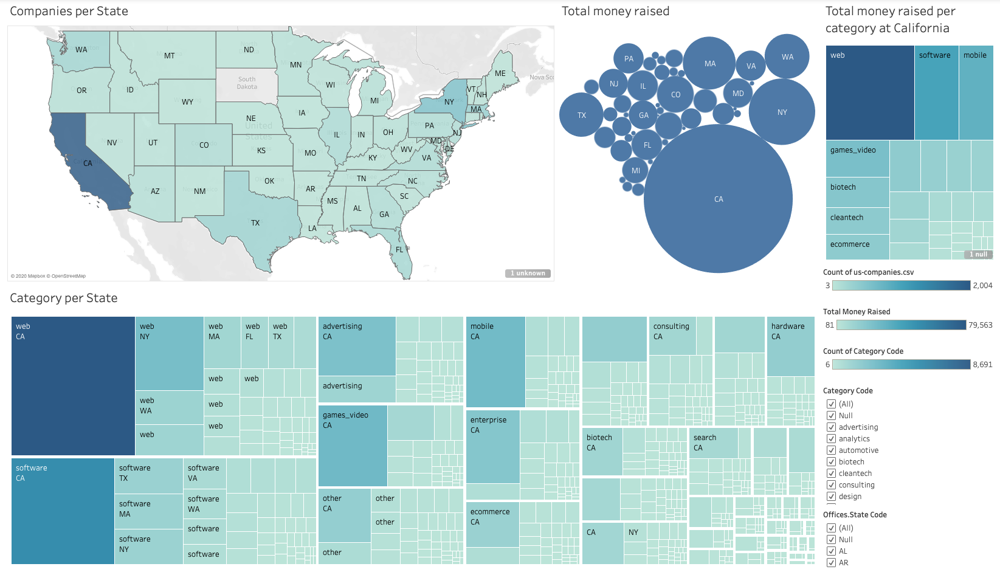
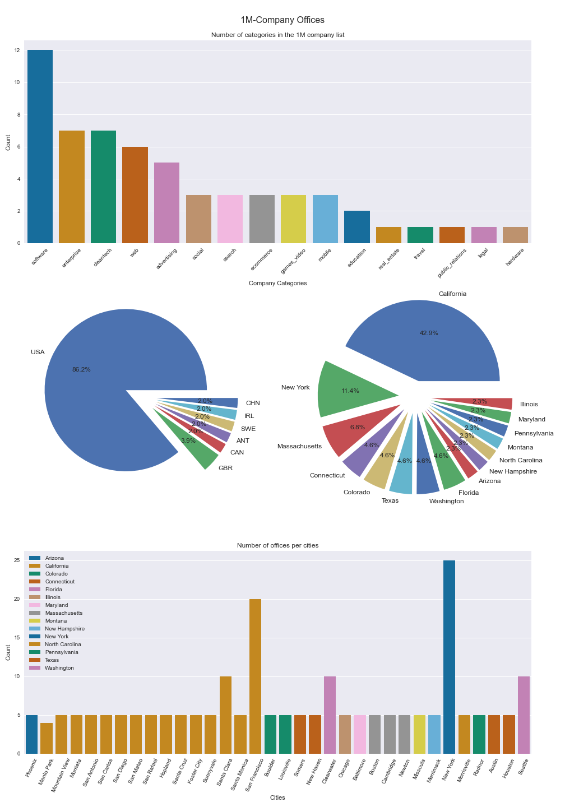
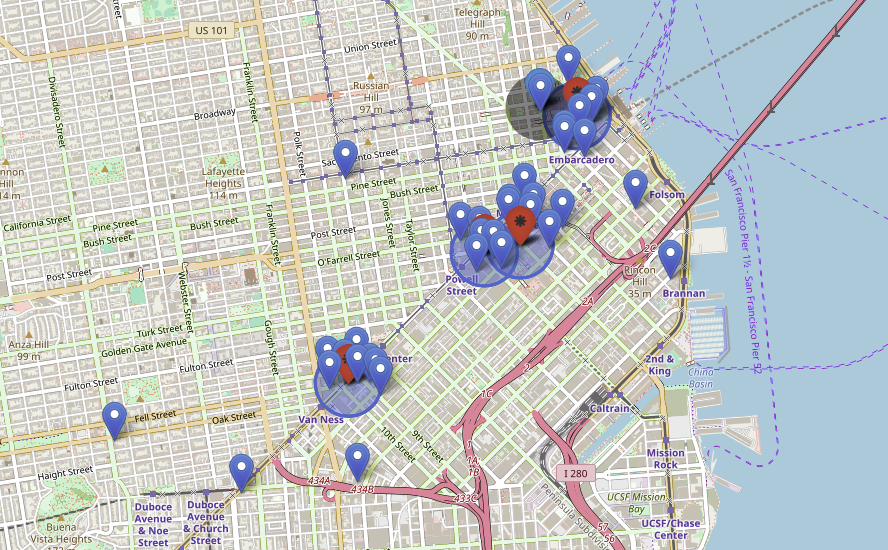

# Geospatial Data Project

## Overview
This work correspond to the fourth project at IronHack, and we were basically asked to study where to locate a new office for a gaming startup; it should be noted that this location must belong to a company in `companies.json` (database provided by IronHack).

Some essential requirements were given as well as a kind a framework.
The followings are some those specifications (quoted from the main document) that have been taken into consideration:
- Developers like to be near successful tech startups that have raised at least 1 Million dollars.
- Executives like Starbucks A LOT. Ensure there's a Starbucks not too far.
- Account managers need to travel a lot.
- All people in the company have between 25 and 40 years, give them some place to go to party.
- The CEO is Vegan.
- The office dog "Pepe" needs a hairdresser every month. Ensure there's one not too far away.
- Designers like to go to design talks and share knowledge. 
- There must be some nearby companies that also do design.
#### Note: 
- Create a new repo in your github account.
- Create an issue to ironhack-datalabs/datamad1020 with your repo link.
- You must justify your decision with a map, use visualization tools like (tableau, folium, cartoframes, etc.)


Readers should consider that different method of analysis and various programming tools were use along this project.

## Development process
1. Firstly, it was consulted the GEI (Global Entrepreneurship Index) ranking in order to have a better understanding of what countries are better candidates to host a new gaming startup. In first place, the data was collected by web scraping. Then the GEI was plotted in relation to the GDP of the first 15 countries. It should be noted USA is first in the GEI ranking and just third at the scale of GDP after Switzerland and Hong Kong. (Source: OECD.org)



2. Then, the database (`companies.json`) was briefly analysed to look for some important patterns. Specifically, this step is focuses on USA because it's the country that best fix with new tech startups due to the two reason below:
    - It's the country where are more venture capital firms and consequently where is easiest to access to these funds.
    - There are located most of the more important tech companies and some relevant universities wich regulary provide high level professionals.

    The raw data `companies.json` is recieved as argument for  `functions.us_companies.py` to generate a cleaner dataset in order to plot it, in this case with Tableau (https://public.tableau.com/profile/gerardo4219#!/vizhome/USA_companies_geolocalization_project/Dashboard1).
   





3. In third place, the study focused on evaluate where the 1 Million companies where located, in which country and city. this phase was developed by a jupyter notebook (`1M-companies.ipynb`).

    The previous step and this one (2 and 3) confirm not only USA as one of the best countries to found a startup but also does stand out California as great place. In this other case, the plot was built using pandas, matplotlib and seaborn.





4. Due to San Francisco is the city that have more 1M-company offices, it was choosen as the city that would host the new startup. Now, it's relevant to located starbucks, restaurants, night clubs, airports, and dog groomers near these 1M-company offices, so it could be study wich have the best place. In order to perform that task, it was developed a pipeline package `search_place` which contains the following functions:
    - `mongo_query_comp.py`
    - `google_place.py`
    - `apply_google_place.py`
    - `process_coordinates.py`
    - `process_surroundings.py`
    - `search_place_app.py` (Main of the package)

    This pipeline basically recieves a MongoDB query, and return  a seire of near places based on some parameters previously set. tis funtionality is based Google Search Place API.

    The parameters used are listed below, as follow `(type,keyword)`:
    
    ```python 
    ('cafe', 'starbucks'),
    ('restaurant', 'vegan restaurant'),
    ('pet_store', 'dog groomer'),
    ('night_club', ''),
    ('airport', 'interntional airport')
    ```

    Then, these places were plotted on a folium map, so it can be easier to visualize how they are distributed along the city and aorund the offices of the companies.

    The following image represents four 1M-company offices in San Francisco (red dot with a blue circle of 500m of diameter to show the scale) with some places of interest around them, based on the parameters previously mentioned.


